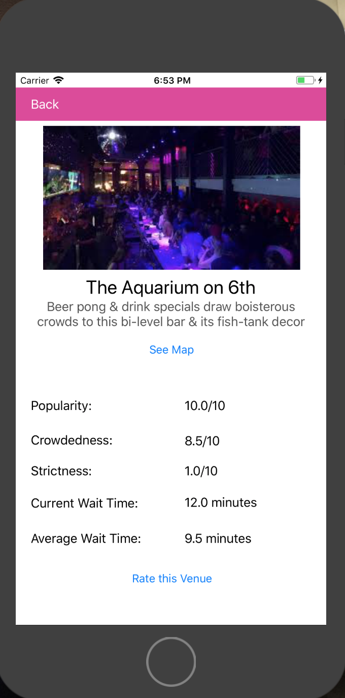

# BarTrackApp

The following is a prototype for an app created by Isabel Stoddart, Cara Nielson, and Krishti Bhowmick for an iOS programming class at The University of Texas at Austin.

The app allows users to rate bars in Austin on multiple criteria including Popularity, Crowdedness, Strictness, Current Wait Time, and Average Wait Time. The app uses Firebase to update wait times and ratings in real time as users add new data. 

The bar scene is an essential part of Austin culture for locals and tourists alike. The purpose of this app is to allow users to find the best bars in Austin whether 'best' for them is defined by popularity, no wait time, or crowdedness.

This app is still in a prototype/beta stage and never made it to the app store.

## Prototype

The storyboarding and coding was done completely in Xcode. Below is a screenshot of the main storyboard and screen grabs of each step of the app.

### Storyboard

### Screen Grabs

The app starts with a home page that allows the user to login to their account or make a new profile.

The user can then enter the app where they will see a screen allowing them to scroll through a selection of bars in Austin. 

They can then pick a bar and see a description and ratings for that bar. There is an option for the user to rate the bar themselves and a map showing where the bar is located.

From the rating menu, the user can rate the bar on Popularity, Crowdedness, Strictness, Current Wait Time, and Average Wait Time.

The user can submit a rating of crowdedness, popularity, and strictness on a scale of 1 to 10.

The user can submit the current wait time in minutes.

The user can then go back to the main screen and select another bar to see the ratings for it or rate it themselves.

## How to Run
This app was created using Xcode.

To run, click on Clone, then run in Xcode, and the code will run right on Xcode!
